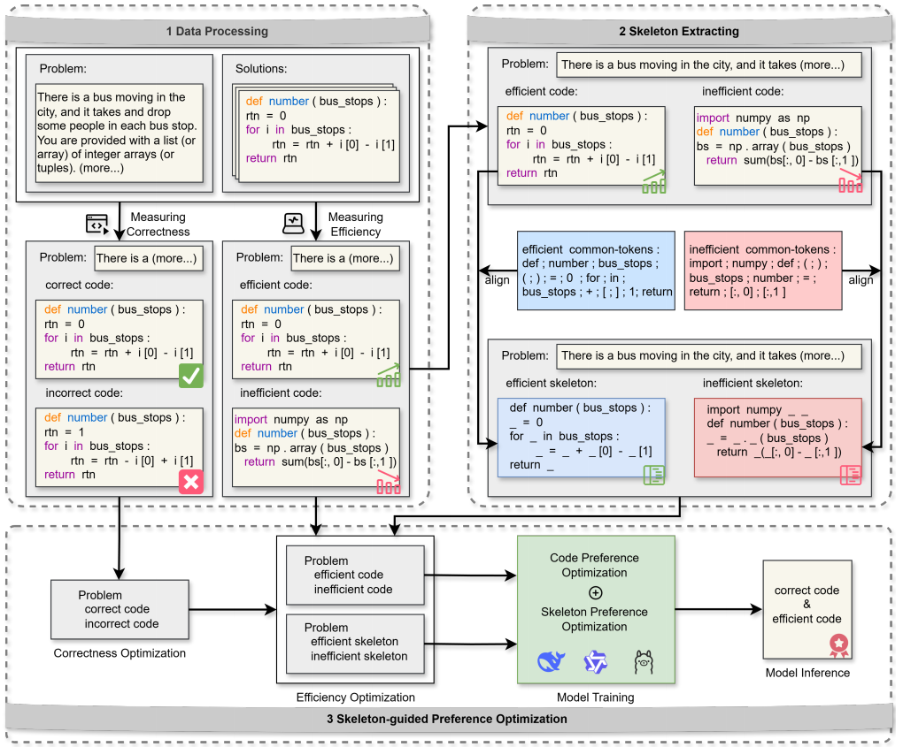

# SkelDPO

⚡️ SkelDPO is a novel framework that extends conventional DPO by incorporating skeleton-guided structural preference modeling.
This repository contains code, data, and models related to the ICPC 2026 paper: "SkelDPO: A Skeleton-Guided Direct Preference Optimization Framework for Efficient Code Generation".

